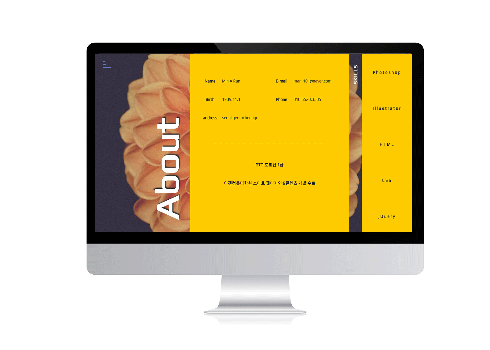
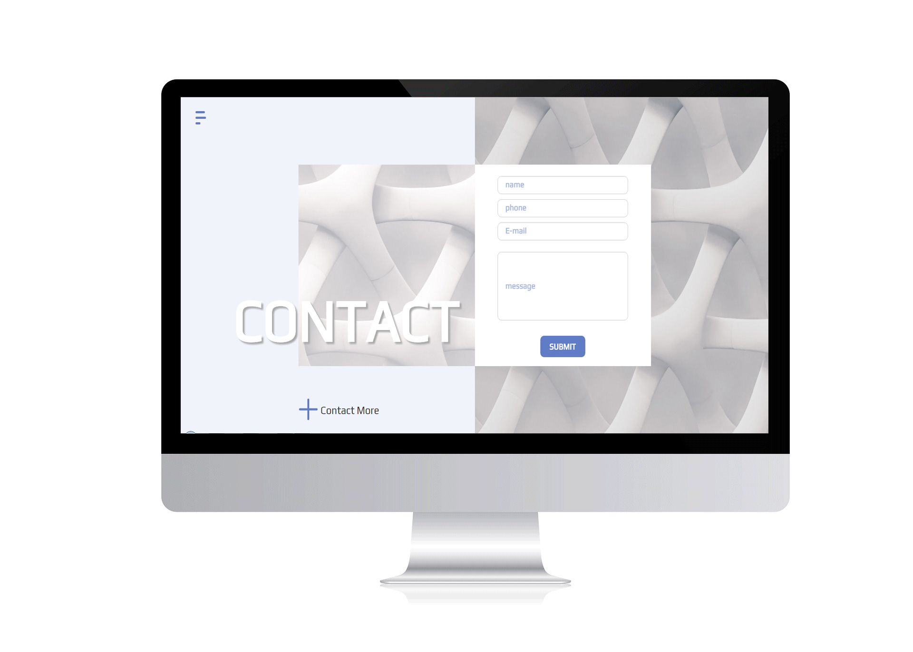
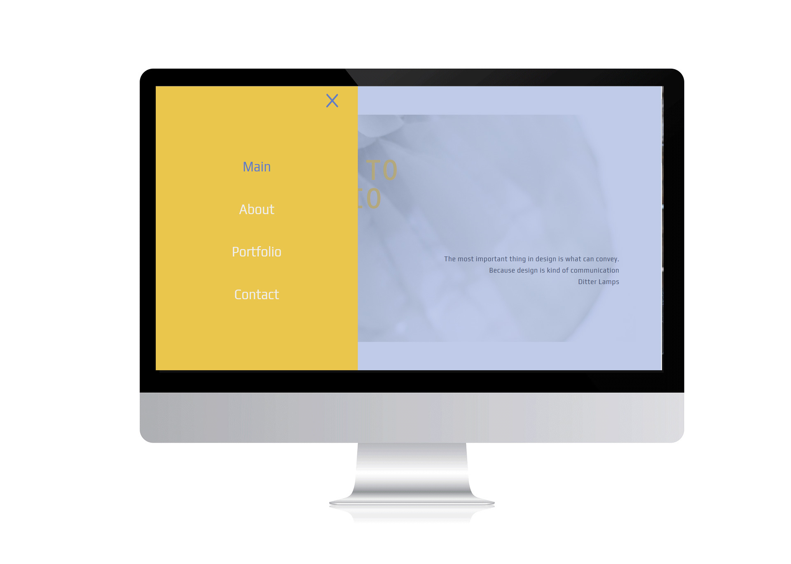

# portfolio_2017

<h3>
마우스 스크롤 이동을 통해 사용자의 불필요한 동작을 최소화하고 빠른 화면전환을 통해 사용자의 필요한 정보의 접근성을 높인 스크롤 디자인 사이트입니다. 
스크롤시 적용되는 레이아웃 이동을 통해 콘텐츠의 강조를 표현하였습니다. 
</h3>

<h2>첫 화면 디자인 </h2>

<h2>about 디자인</h2>

<h2>contact 디자인</h2>

<h2>숨겨진 메뉴</h2>
